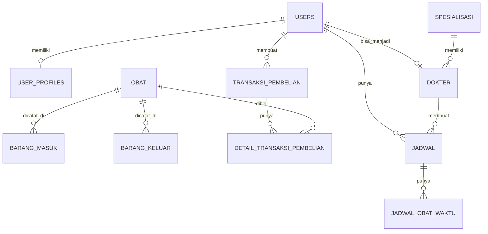

# Panduan Belajar Project Ujikom HealTack

## 1. Tujuan Dokumen
Dokumen ini dibuat supaya project kamu lebih mudah dipahami dengan gaya anak SMK.
Bahasa yang dipakai dibuat sederhana, tidak terlalu teori, dan langsung dikaitkan dengan project yang sedang kamu kerjakan.

Isi dokumen ini:
- gambaran project
- struktur folder penting
- alur fitur utama
- relasi tabel dan model
- penjelasan controller dengan bahasa sederhana
- pengenalan Query Builder
- pengenalan SQL dasar yang dipakai di project ini

---

## 2. Gambaran Project
Nama project ini adalah **HealTack**.
Secara umum, project ini adalah sistem kesehatan yang punya beberapa fitur utama:
- login dan register user
- login dengan Google
- manajemen dokter
- manajemen spesialisasi
- manajemen obat
- barang masuk obat
- barang keluar obat
- konsultasi
- catatan medis
- jadwal minum obat
- toko / pembelian obat online

Project ini memakai:
- **Laravel** untuk backend
- **Blade** untuk tampilan
- **MySQL** atau database relasional lain untuk penyimpanan data
- **Midtrans** untuk pembayaran
- **Socialite** untuk login Google

---

## 3. Struktur Folder Penting

### `app/Http/Controllers`
Folder ini berisi controller.
Controller tugasnya menerima request dari user lalu mengatur proses.

Contoh:
- `Admin/ObatController.php`
- `Staff/BarangMasukController.php`
- `Staff/BarangKeluarController.php`
- `TokoController.php`

### `app/Models`
Folder ini berisi model.
Model dipakai untuk berhubungan dengan tabel database.

Contoh:
- `User.php`
- `Obat.php`
- `Dokter.php`
- `BarangMasuk.php`
- `BarangKeluar.php`
- `TransaksiPembelian.php`

### `resources/views`
Folder ini berisi tampilan Blade.
Jadi file HTML halaman ada di sini.

Contoh:
- `resources/views/admin/...`
- `resources/views/staff/...`
- `resources/views/user/...`

### `routes/web.php`
File ini berisi daftar route web.
Route adalah penghubung antara URL dan controller.

### `database/migrations`
Folder ini berisi file pembentuk tabel database.
Kalau migration dijalankan, Laravel akan membuat tabel sesuai isi file migration.

---

## 4. Role di Project
Di project ini ada beberapa role utama:
- `admin`
- `dokter`
- `staff`
- `user`

### Admin
Tugas admin lebih ke mengelola data utama, seperti:
- data dokter
- data user
- data staff
- data spesialisasi
- data obat
- monitoring pembelian

### Dokter
Tugas dokter lebih ke:
- melihat konsultasi
- membuat catatan medis
- mengatur jadwal obat
- melihat data obat

### Staff
Tugas staff lebih ke operasional:
- barang masuk
- barang keluar
- penjualan
- pembelian user
- kelola obat

### User
Tugas user lebih ke:
- isi profil
- konsultasi
- lihat jadwal obat
- beli obat di toko
- checkout dan bayar

---

## 5. Alur Besar Project
Kalau disederhanakan, alur project ini seperti ini:

1. User login ke sistem
2. Role menentukan menu yang bisa dibuka
3. Admin mengelola master data
4. Staff mengelola stok obat dan transaksi
5. Dokter mengelola catatan medis dan jadwal obat
6. User bisa konsultasi dan beli obat
7. Saat ada pembelian obat, sistem membuat transaksi pembelian
8. Staff dan admin bisa memonitor transaksi itu

---

## 6. Route dan Alur URL
File route utama ada di:
- `routes/web.php`

Di sana route dibagi berdasarkan role.

### Public
Contoh:
- `/`
- `/auth/google`
- `/otp/verify`

### Admin
Prefix admin:
- `/admin/...`

Contoh:
- `/admin/dashboard`
- `/admin/dokter`
- `/admin/obat`
- `/admin/obat/pembelian`

### Dokter
Prefix dokter:
- `/dokter/...`

### Staff
Prefix staff:
- `/staff/...`

Contoh:
- `/staff/barang-masuk`
- `/staff/barang-keluar`
- `/staff/penjualan`

### User
Prefix user:
- `/user/...`

### Toko
Prefix toko:
- `/toko/...`

Contoh:
- `/toko`
- `/toko/keranjang`
- `/toko/checkout`
- `/toko/pembayaran/{id}`

---

## 7. Struktur Database dan Relasi
Bagian ini penting banget karena inti Laravel itu biasanya hubungan antara model dan tabel.

### Tabel penting yang terlihat dari migration dan model
- `users`
- `user_profiles`
- `spesialisasi`
- `dokter`
- `obat`
- `barang_masuk`
- `barang_keluar`
- `catatan_medis`
- `jadwal`
- `jadwal_obat_waktu`
- `transaksi_pembelian`
- `detail_transaksi_pembelian`

### Gambaran relasi sederhana
- satu `user` punya satu `profile`
- satu `user` bisa punya satu data `dokter`
- satu `spesialisasi` punya banyak `dokter`
- satu `obat` punya banyak `barang_masuk`
- satu `obat` punya banyak `barang_keluar`
- satu `user` bisa punya banyak `transaksi_pembelian`
- satu `transaksi_pembelian` punya banyak `detail_transaksi_pembelian`
- satu `detail_transaksi_pembelian` milik satu `obat`
- satu `jadwal` bisa punya banyak `jadwal_obat_waktu`

### ERD sederhana


---

## 8. Penjelasan Model Satu per Satu

### `User`
File:
- `app/Models/User.php`

Fungsi model ini:
- menyimpan data akun
- menyimpan role
- menyimpan status user
- relasi ke profile, dokter, dan jadwal

Relasi penting:
- `profile()` -> satu user punya satu profile
- `dokter()` -> satu user bisa punya satu dokter
- `jadwal()` -> satu user punya banyak jadwal

Method penting:
- `isAdmin()`
- `isDokter()`
- `isStaff()`
- `isPengguna()`

Artinya method itu dipakai untuk cek role user.

### `Obat`
File:
- `app/Models/Obat.php`

Fungsi model ini:
- menyimpan data obat
- relasi ke barang masuk
- relasi ke barang keluar
- relasi ke user yang input data

Relasi:
- `user()`
- `barangMasuk()`
- `barangKeluar()`

Scope penting:
- `tersedia()` -> ambil obat yang stoknya masih ada
- `stokMenupis()` -> ambil obat yang stoknya mulai sedikit
- `stokHabis()` -> ambil obat yang stoknya nol

### `Dokter`
File:
- `app/Models/Dokter.php`

Relasi:
- `pengguna()` -> ke tabel user
- `spesialisasi()` -> ke tabel spesialisasi

Artinya data dokter itu terhubung ke akun user dan juga spesialisasi.

### `Spesialisasi`
File:
- `app/Models/Spesialisasi.php`

Relasi:
- `dokter()` -> satu spesialisasi punya banyak dokter

### `BarangMasuk`
File:
- `app/Models/BarangMasuk.php`

Fungsi:
- mencatat obat yang masuk ke stok

Relasi:
- `obat()` -> data ini milik satu obat

Kalau barang masuk ditambahkan, stok obat bertambah.

### `BarangKeluar`
File:
- `app/Models/BarangKeluar.php`

Fungsi:
- mencatat obat yang keluar dari stok

Relasi:
- `obat()` -> data ini milik satu obat

Kalau barang keluar ditambahkan, stok obat berkurang.

### `TransaksiPembelian`
File:
- `app/Models/TransaksiPembelian.php`

Fungsi:
- menyimpan kepala transaksi pembelian user

Contoh isi:
- user siapa yang beli
- total harga
- status pembayaran
- alamat pengiriman

Relasi:
- `user()`
- `details()`
- `verifiedBy()`

### `DetailTransaksiPembelian`
File:
- `app/Models/DetailTransaksiPembelian.php`

Fungsi:
- menyimpan item obat apa saja yang dibeli dalam satu transaksi

Relasi:
- `obat()`
- `transaksi()`

### `UserProfile`
File:
- `app/Models/UserProfile.php`

Fungsi:
- menyimpan biodata tambahan user

Relasi:
- `user()`

### `Jadwal`
File:
- `app/Models/Jadwal.php`

Fungsi:
- menyimpan jadwal minum obat

Relasi:
- `catatanMedis()`
- `waktuObat()`
- `user()`
- `dokter()`

---

## 9. Alur Fitur Obat dan Stok
Ini salah satu alur paling penting di project kamu.

### Barang Masuk
Alurnya:
1. Staff pilih obat
2. Isi jumlah barang masuk
3. Simpan data barang masuk
4. Stok obat ditambah

Controller yang mengatur:
- `Staff/BarangMasukController.php`

### Barang Keluar
Alurnya:
1. Staff pilih obat
2. Isi jumlah barang keluar
3. Sistem cek stok cukup atau tidak
4. Kalau cukup, data disimpan
5. Stok obat dikurangi

Controller yang mengatur:
- `Staff/BarangKeluarController.php`

### Penjualan
Di project ini penjualan memakai data `BarangKeluar` dengan kode tertentu, misalnya `PJ-...`.
Jadi konsepnya, penjualan dianggap stok keluar.

---

## 10. Alur Pembelian Obat Online
Fitur ini diatur terutama oleh:
- `app/Http/Controllers/TokoController.php`

Alur sederhananya:
1. User buka halaman toko
2. User pilih obat
3. User tambah ke keranjang
4. User checkout
5. Sistem membuat transaksi pembelian
6. Sistem membuat detail transaksi pembelian
7. User diarahkan ke pembayaran
8. Status transaksi akan berubah sesuai pembayaran

Data yang dipakai:
- `obat`
- `transaksi_pembelian`
- `detail_transaksi_pembelian`

Kenapa ini penting?
Karena dari sini admin dan staff bisa memonitor pembelian user.

---

## 11. Controller Itu Kerjanya Apa?
Biar gampang, anggap saja controller itu seperti "petugas pengatur alur".

Contoh sederhana:
```php
public function store(Request $request)
{
    $request->validate([
        'nama_obat' => 'required',
        'stok' => 'required|numeric',
    ]);

    Obat::create([
        'nama_obat' => $request->nama_obat,
        'stok' => $request->stok,
    ]);

    return redirect()->route('staff.obat.index');
}
```

Penjelasan:
- `validate()` untuk cek input
- `create()` untuk simpan data
- `redirect()` untuk pindah halaman

Jadi pola controller biasanya seperti ini:
1. terima request
2. validasi input
3. ambil / simpan / update / hapus data
4. kirim ke view atau redirect

---

## 12. Apa Itu Query Builder?
Query Builder adalah cara Laravel menulis query database tanpa harus menulis SQL mentah terus-menerus.

Contoh:
```php
$obat = Obat::where('stok', '>', 0)->get();
```

Artinya:
- ambil data obat yang stoknya lebih dari 0

Kalau dalam SQL:
```sql
SELECT * FROM obat WHERE stok > 0;
```

Jadi Query Builder itu seperti versi Laravel dari SQL.

---

## 13. Query Builder Dasar yang Wajib Dipahami

### `get()`
Mengambil banyak data.
```php
$obat = Obat::get();
```
SQL:
```sql
SELECT * FROM obat;
```

### `first()`
Mengambil satu data pertama.
```php
$obat = Obat::where('status', 1)->first();
```
SQL:
```sql
SELECT * FROM obat WHERE status = 1 LIMIT 1;
```

### `find()`
Mencari berdasarkan id.
```php
$obat = Obat::find(1);
```
SQL:
```sql
SELECT * FROM obat WHERE id = 1 LIMIT 1;
```

### `findOrFail()`
Sama seperti `find()`, tapi kalau data tidak ada akan error 404.
```php
$obat = Obat::findOrFail($id);
```

### `where()`
Untuk filter.
```php
$obat = Obat::where('status', 1)->get();
```
SQL:
```sql
SELECT * FROM obat WHERE status = 1;
```

### `orWhere()`
Filter tambahan dengan kondisi OR.
```php
$obat = Obat::where('nama_obat', 'like', '%paracetamol%')
    ->orWhere('kode_obat', 'like', '%OBT%')
    ->get();
```
SQL:
```sql
SELECT * FROM obat
WHERE nama_obat LIKE '%paracetamol%'
OR kode_obat LIKE '%OBT%';
```

### `latest()`
Mengurutkan dari data terbaru.
```php
$barangMasuk = BarangMasuk::latest()->get();
```
Biasanya artinya:
```sql
SELECT * FROM barang_masuk ORDER BY created_at DESC;
```

### `orderBy()`
Urutkan data.
```php
$obat = Obat::orderBy('nama_obat', 'asc')->get();
```
SQL:
```sql
SELECT * FROM obat ORDER BY nama_obat ASC;
```

### `paginate()`
Membagi data per halaman.
```php
$obat = Obat::paginate(10);
```

### `count()`
Menghitung jumlah data.
```php
$totalObat = Obat::count();
```
SQL:
```sql
SELECT COUNT(*) FROM obat;
```

### `sum()`
Menjumlahkan kolom.
```php
$totalStok = Obat::sum('stok');
```
SQL:
```sql
SELECT SUM(stok) FROM obat;
```

### `create()`
Simpan data baru.
```php
Obat::create([
    'nama_obat' => 'Paracetamol',
    'stok' => 20,
    'harga' => 5000,
]);
```
SQL:
```sql
INSERT INTO obat (nama_obat, stok, harga)
VALUES ('Paracetamol', 20, 5000);
```

### `update()`
Update data.
```php
$obat->update([
    'stok' => 30,
]);
```
SQL:
```sql
UPDATE obat SET stok = 30 WHERE id = ...;
```

### `delete()`
Hapus data.
```php
$obat->delete();
```
SQL:
```sql
DELETE FROM obat WHERE id = ...;
```

---

## 14. Relasi Eloquent yang Wajib Dipahami

### `belongsTo()`
Artinya model ini milik model lain.

Contoh:
```php
public function obat()
{
    return $this->belongsTo(Obat::class, 'id_obat');
}
```

Artinya:
- `BarangMasuk` punya satu `Obat`
- foreign key-nya `id_obat`

### `hasMany()`
Artinya satu data punya banyak data lain.

Contoh:
```php
public function barangMasuk()
{
    return $this->hasMany(BarangMasuk::class, 'id_obat');
}
```

Artinya:
- satu obat bisa muncul di banyak data barang masuk

### `hasOne()`
Artinya satu data punya satu data lain.

Contoh:
```php
public function profile()
{
    return $this->hasOne(UserProfile::class, 'user_id');
}
```

Artinya satu user punya satu profile.

---

## 15. Eager Loading
Kadang kita butuh ambil data sekaligus relasinya.
Laravel punya fitur `with()`.

Contoh:
```php
$barangKeluar = BarangKeluar::with('obat')->latest()->paginate(10);
```

Artinya:
- ambil data barang keluar
- sekalian ambil data obat yang berelasi

Keuntungan:
- query lebih efisien
- mengurangi N+1 problem

Kalau tanpa `with()`, bisa jadi query terlalu banyak.

---

## 16. Query Builder yang Nyambung dengan Project Ini

### Ambil semua obat aktif dan stok masih ada
```php
$obat = Obat::where('status', 1)
    ->where('stok', '>', 0)
    ->get();
```
SQL:
```sql
SELECT * FROM obat
WHERE status = 1 AND stok > 0;
```

### Hitung total user role staff
```php
$totalStaff = User::where('role', 'staff')->count();
```
SQL:
```sql
SELECT COUNT(*) FROM users WHERE role = 'staff';
```

### Tampilkan barang keluar terbaru
```php
$barangKeluar = BarangKeluar::with('obat')->latest()->paginate(10);
```
SQL kira-kira:
```sql
SELECT * FROM barang_keluar ORDER BY created_at DESC LIMIT 10;
```

### Ambil transaksi pembelian milik user tertentu
```php
$transaksi = TransaksiPembelian::where('user_id', auth()->id())
    ->with('details.obat')
    ->latest()
    ->paginate(10);
```
SQL sederhananya:
```sql
SELECT * FROM transaksi_pembelian
WHERE user_id = 5
ORDER BY created_at DESC;
```

---

## 17. SQL Dasar yang Harus Kamu Paham

### `SELECT`
Untuk mengambil data.
```sql
SELECT * FROM obat;
```

### `WHERE`
Untuk filter data.
```sql
SELECT * FROM obat WHERE stok > 0;
```

### `INSERT`
Untuk menambah data.
```sql
INSERT INTO obat (nama_obat, stok, harga)
VALUES ('Amoxicillin', 10, 12000);
```

### `UPDATE`
Untuk mengubah data.
```sql
UPDATE obat
SET stok = 20
WHERE id = 1;
```

### `DELETE`
Untuk menghapus data.
```sql
DELETE FROM obat WHERE id = 1;
```

### `ORDER BY`
Untuk mengurutkan data.
```sql
SELECT * FROM obat ORDER BY nama_obat ASC;
```

### `COUNT()`
Untuk menghitung jumlah data.
```sql
SELECT COUNT(*) FROM users WHERE role = 'user';
```

### `SUM()`
Untuk menjumlahkan data angka.
```sql
SELECT SUM(stok) FROM obat;
```

### `JOIN`
Untuk menggabungkan tabel.
```sql
SELECT transaksi_pembelian.kode_transaksi, users.name
FROM transaksi_pembelian
JOIN users ON users.id = transaksi_pembelian.user_id;
```

Artinya:
- ambil kode transaksi
- gabungkan dengan nama user yang membeli

---

## 18. Contoh Join yang Penting di Project

### Lihat detail pembelian beserta nama obat
```sql
SELECT d.transaksi_pembelian_id, o.nama_obat, d.jumlah, d.subtotal
FROM detail_transaksi_pembelian d
JOIN obat o ON o.id = d.id_obat;
```

### Lihat dokter beserta spesialisasinya
```sql
SELECT d.nama, s.name AS spesialisasi
FROM dokter d
JOIN spesialisasi s ON s.id = d.spesialisasi_id;
```

### Lihat barang keluar beserta nama obat
```sql
SELECT bk.kode, o.nama_obat, bk.jumlah, bk.tanggal_keluar
FROM barang_keluar bk
JOIN obat o ON o.id = bk.id_obat;
```

---

## 19. Cara Membaca Controller dengan Mudah
Kalau kamu buka controller, baca dengan urutan ini:

### `index()`
Biasanya untuk menampilkan daftar data.

### `create()`
Biasanya untuk menampilkan form tambah data.

### `store()`
Biasanya untuk menyimpan data baru.

### `show()`
Biasanya untuk melihat detail satu data.

### `edit()`
Biasanya untuk menampilkan form edit.

### `update()`
Biasanya untuk menyimpan hasil edit.

### `destroy()`
Biasanya untuk menghapus data.

Kalau kamu hafal 7 method ini, kamu bakal lebih gampang baca Laravel.

---

## 20. Cara Belajar Project Ini Biar Cepat Paham
Saran belajar paling enak:

1. pahami route dulu
2. lihat controller yang dipanggil route
3. lihat model yang dipakai controller
4. lihat view yang ditampilkan
5. cek tabel database yang berhubungan

Urutan ini penting supaya kamu nggak bingung.

Contoh:
- route `/staff/barang-keluar`
- masuk ke `BarangKeluarController`
- pakai model `BarangKeluar` dan `Obat`
- tampil ke view `staff/barang-keluar/...`
- data berasal dari tabel `barang_keluar` dan `obat`

---

## 21. Bagian Project yang Paling Penting Buat Ujikom
Kalau buat presentasi atau ujikom, bagian yang paling penting dipahami adalah:
- login dan role
- CRUD data utama
- relasi antar tabel
- stok obat
- pembelian obat online
- pembayaran
- jadwal obat
- catatan medis

Kalau kamu bisa jelaskan itu dengan runtut, project kamu sudah kelihatan matang.

---

## 22. Contoh Penjelasan Singkat Saat Presentasi
Contoh:

"Project ini adalah sistem kesehatan berbasis Laravel yang memiliki beberapa role yaitu admin, dokter, staff, dan user. Admin mengelola data utama seperti dokter, spesialisasi, user, dan monitoring pembelian. Staff mengelola operasional stok obat seperti barang masuk, barang keluar, dan penjualan. Dokter mengelola catatan medis serta jadwal obat. User dapat melakukan konsultasi dan pembelian obat secara online. Sistem ini memakai relasi database seperti user ke profile, spesialisasi ke dokter, serta transaksi pembelian ke detail transaksi pembelian."

---

## 23. Catatan Penting Tentang Code Style
Kamu tadi minta code dibuat lebih gaya anak SMK.
Maksudnya bukan jelek, tapi:
- alur lebih lurus
- tidak terlalu banyak trik
- gampang dijelaskan saat presentasi
- tetap aman dan tetap jalan

Jadi gaya yang cocok adalah:
- validasi sederhana
- `findOrFail()` kalau ambil data
- `if` biasa untuk cek kondisi
- `create`, `update`, `delete` langsung dan jelas
- relasi dipakai seperlunya

---

## 24. Hal yang Perlu Kamu Pelajari Berikutnya
Setelah paham dokumen ini, kamu bisa lanjut belajar:
- middleware
- request validation
- file upload
- authentication
- payment gateway
- API dasar
- normalisasi database

---

## 25. Kesimpulan
Inti dari project ini adalah:
- Laravel mengatur alur dengan route, controller, model, dan view
- database dihubungkan dengan relasi Eloquent
- stok obat bergerak lewat barang masuk dan barang keluar
- pembelian online memakai transaksi pembelian dan detail transaksi
- setiap role punya tugas masing-masing

Kalau kamu paham alur data, relasi tabel, dan query dasar, maka project ini akan jauh lebih mudah kamu kuasai.
